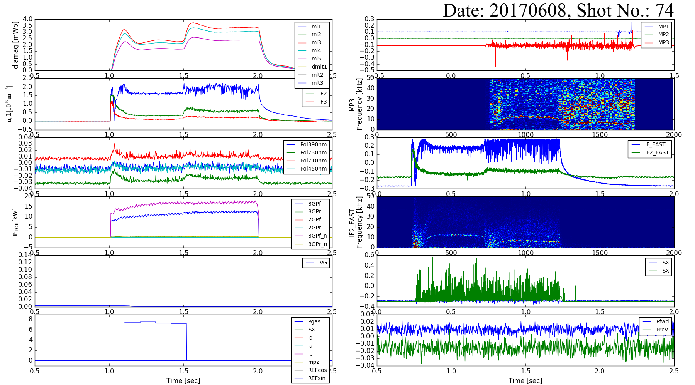

# RT-1 Data Browser
___PythonでWE7000で収集したRT-1のデータを表示する___

## Usage
- Locate RT1DataBrowser.py and read_wvf.py in the same directory.
- Modify the "date" and "ShotNo".
- Run the RT1DataBrowser.py

## Sample

## ToDo
- [x] read_wvf.pyを統合する
- [x] OSを判定して動作（特にパスの指定, windowsは始めに"\\\\\\\\"が必要）
